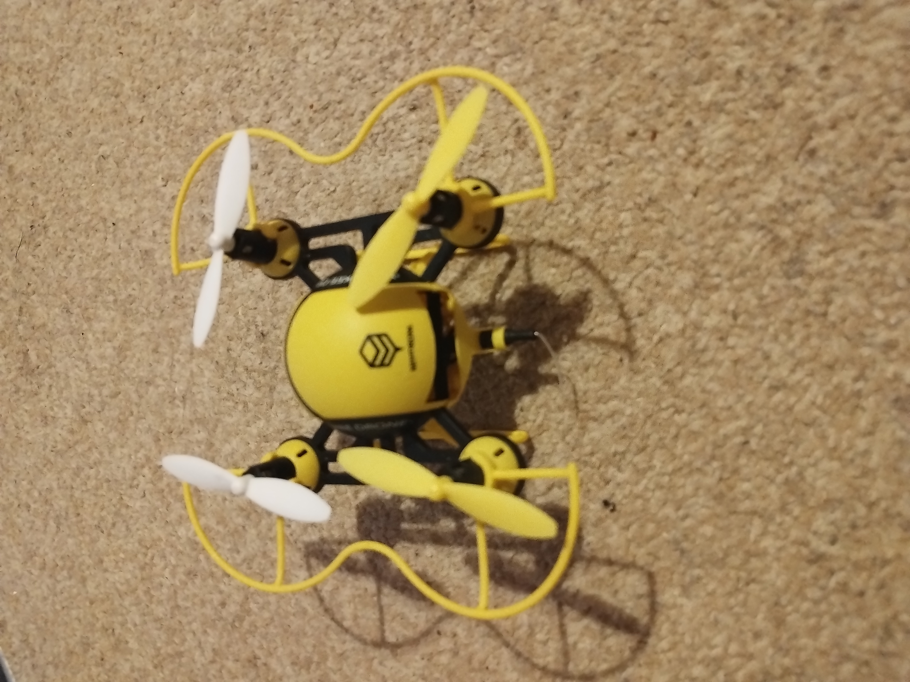
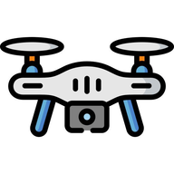

# DroneCamera



An Android app for viewing the live video stream from HASAKEE FPV drones. Built by reverse engineering the proprietary UDP protocol used by the drone's WiFi camera.

## Supported Drone

- **HASAKEE FPV Drone** (WiFi SSID: `HASAKEE-WiFi-XXXXX`)
- VGA camera using the 0x6363 UDP protocol
- Drone IP: `192.168.0.1`, video port: `40000`

Other HASAKEE/Lewei-based drones using the same protocol may also work.

## Features

- Automatic WiFi connection to drone network (API 29+ uses `WifiNetworkSpecifier`, API 26-28 checks existing connection)
- Real-time MJPEG video stream decoding and display
- Multi-packet UDP frame assembly with proper sequencing
- VGA data deobfuscation support (for older camera firmware)
- Heartbeat keepalive to maintain video stream
- Connection loss detection (3 second timeout)

## Screenshots

*App icon:*



Drone icon by [Flaticon](https://www.flaticon.com/free-icon/drone_1830867) — free for personal and commercial use with attribution.

## How It Works

The app communicates with the drone over UDP:

1. Connects to the drone's WiFi access point (`HASAKEE-WiFi-XXXXX`)
2. Sends a heartbeat packet (`63 63 01 00 00 00 00`) every 1 second to `192.168.0.1:40000`
3. Receives multi-packet video frames using the 0x6363 protocol
4. Assembles packets into complete JPEG frames and displays them

### Protocol Details

The drone uses a proprietary packet format reverse engineered from the HASAKEE FPV Android app's native libraries (`liblewei-2.3.so`, `liblewei63.so`):

```
Offset 0x00-0x01: 0x6363 (magic header)
Offset 0x02:      Command type (0x01=heartbeat, 0x03=video)
Offset 0x03-0x04: Sequence ID
Offset 0x05-0x06: Packet length
Offset 0x07:      Frame type
Offset 0x08-0x0B: Frame ID
Offset 0x36 (54): JPEG data start
```

## Reverse Engineering

This app was built from protocol knowledge gained by reverse engineering the **HASAKEE FPV** Android app (version 1.0.4), specifically its native libraries using Ghidra and Wireshark packet analysis.

The full reverse engineering work, including decompiled protocol documentation, Python proof-of-concept streaming code, and detailed protocol notes, is available at:

**[DroneReverseEngineer](https://github.com/mretallack/DroneReverseEngineer)**

## Building

### Prerequisites

- JDK 17+
- Android SDK (compile SDK 35, min SDK 26)

### Build Debug APK

```bash
git clone https://github.com/mretallack/DroneCamera.git
cd DroneCamera
./gradlew assembleDebug
```

The APK will be at `app/build/outputs/apk/debug/app-debug.apk`.

### Build Release APK

Release builds require a signing keystore:

```bash
export KEYSTORE_PATH=release.keystore
export KEYSTORE_PASSWORD=<your-password>
export KEY_ALIAS=release
export KEY_PASSWORD=<your-password>
./gradlew assembleRelease
```

The signed APK will be at `app/build/outputs/apk/release/app-release.apk`.

### Install on Device

```bash
./gradlew installDebug
```

### Run Tests

```bash
./gradlew test
```

### Run Lint

```bash
./gradlew lintDebug
```

## Project Structure

```
app/src/main/java/uk/org/retallack/dronecamera/
├── FrameAssembler.kt       # 0x6363 packet parser, frame assembly, deobfuscation
├── DroneConnection.kt      # UDP heartbeat sender and packet receiver
├── WifiConnector.kt        # Auto-connect to HASAKEE drone WiFi
├── DroneStreamViewModel.kt # State management (IDLE/CONNECTING/STREAMING/ERROR)
└── MainActivity.kt         # SurfaceView video display and UI
```

## License

This project is licensed under the MIT License — see [LICENSE](LICENSE) for details.

Drone icon by [Flaticon](https://www.flaticon.com/free-icon/drone_1830867).
